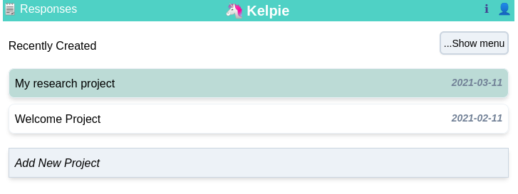
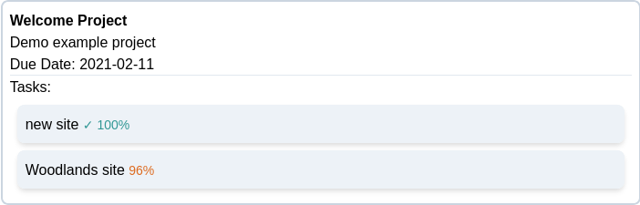
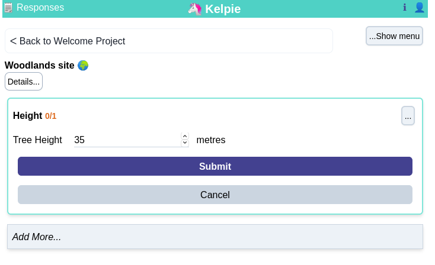
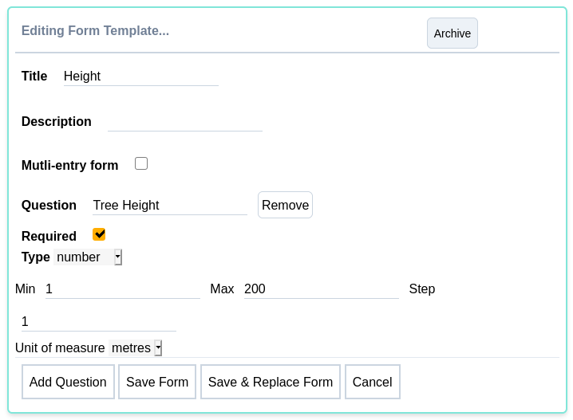

# Kelpie

Kelpie aims to be a prototype/demo app for planning and recording survey data either on or offline. Full of bugs and hacks...just a testbed for tinkering with js, ember, pouch, html, css, linting...

See [Demo](https://kelpie.netlify.app) (requires password)

### Manage Projects

### Create Tasks

### Enter form data

### Edit forms

## Prerequisites

You will need the following things properly installed on your computer.

* [Git](https://git-scm.com/)
* [couchdb](https://docs.couchdb.org/en/stable/install/index.html)
* [Node.js](https://nodejs.org/) (with npm)
* [Ember CLI](https://ember-cli.com/)
* [Google Chrome](https://google.com/chrome/)

## Installation

* `git clone <repository-url>` this repository
* `cd kelpie`
* `npm install`
* Create user 'test' and password 'test' with admin role in couchdb for testing purposes.

## Running / Development

* `ember serve`
* Visit your app at [http://localhost:4200](http://localhost:4200).
* Visit your tests at [http://localhost:4200/tests](http://localhost:4200/tests).

### Code Generators

Make use of the many generators for code, try `ember help generate` for more details

### Running Tests

* `ember test`
* `ember test --server`

### Linting

* `npm run lint:hbs`
* `npm run lint:js`
* `npm run lint:js -- --fix`

### Building

* `ember build` (development)
* `ember build --environment production` (production)

### Deploying

* Need to host couchdb or use IBM cloudant. 
* If hosting couchdb - need https certificate setup.
* May need to add `same_site` = `strict` in couchdb `couch_httpd_auth` section of options/config via futon app.

## Further Reading / Useful Links

* [ember.js](https://emberjs.com/)
* [ember-cli](https://ember-cli.com/)
* Development Browser Extensions
  * [ember inspector for chrome](https://chrome.google.com/webstore/detail/ember-inspector/bmdblncegkenkacieihfhpjfppoconhi)
  * [ember inspector for firefox](https://addons.mozilla.org/en-US/firefox/addon/ember-inspector/)
